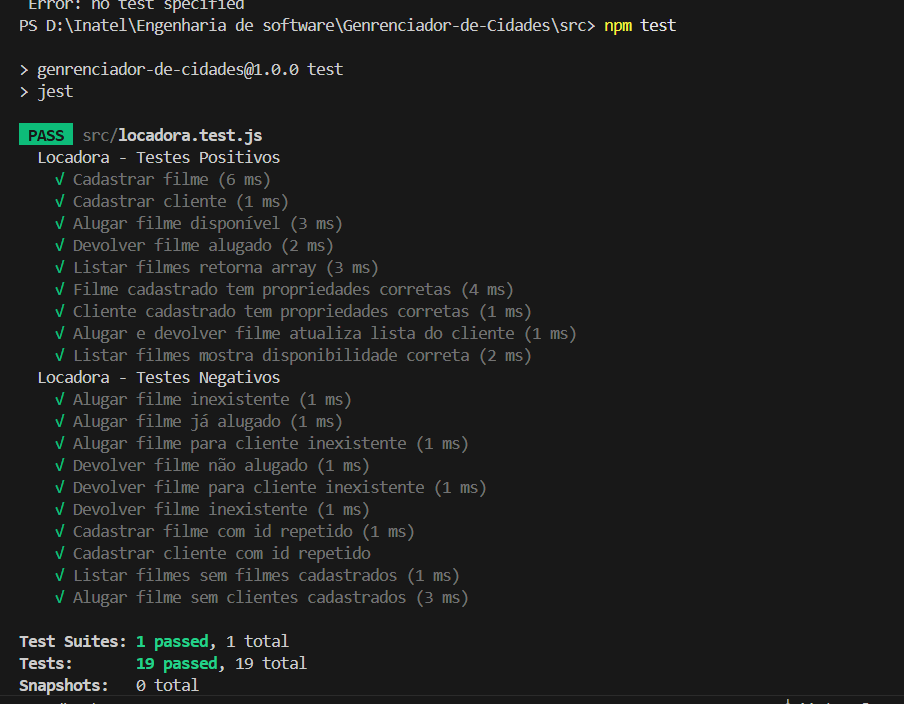
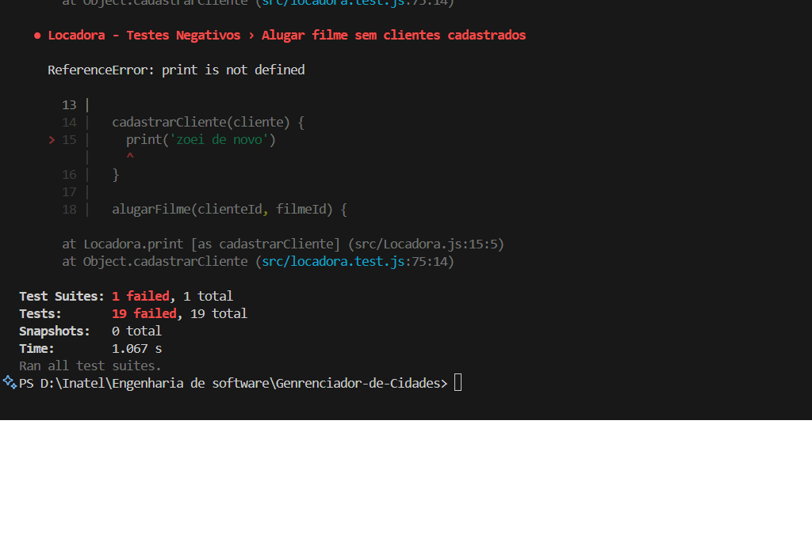

# Sistema de Locadora de Filmes

Projeto Node.js orientado a objetos para controle de uma locadora de filmes. Permite cadastrar filmes e clientes, alugar e devolver filmes, e listar o catálogo, tudo via interação no terminal.

## Tecnologias Utilizadas
- Node.js
- Jest (para testes unitários)

## Funcionalidades
- Cadastrar filmes
- Cadastrar clientes
- Alugar filmes
- Devolver filmes
- Listar filmes

## Estrutura do Projeto
```
Genrenciador-de-Cidades/
├── src/
│   ├── Filme.js         # Classe Filme
│   ├── Cliente.js       # Classe Cliente
│   ├── Locadora.js      # Classe Locadora
│   ├── index.js         # Ponto de entrada interativo
│   └── locadora.test.js # Testes unitários
│   ├── testesOK.png     # Evidência dos testes OK
│   ├── testesNOK.png    # Evidência dos testes NOK
├── package.json         # Dependências e scripts
└── README.md            # Documentação
```

## Como executar
1. Instale as dependências:
   ```powershell
   npm install
   ```
2. Execute o sistema interativo:
   ```powershell
   node src/index.js
   ```
   Siga o menu apresentado no terminal para interagir com o sistema.

## Testes Unitários
Os testes utilizam o Jest e cobrem cenários positivos e negativos. Para rodar os testes:

1. Instale o Jest:
   ```powershell
   npm install --save-dev jest
   ```
2. Adicione ao seu `package.json`:
   ```json
   "scripts": {
     "test": "jest"
   }
   ```
3. Execute os testes:
   ```powershell
   npm test
   ```

## Evidências dos Testes


### Antes do PR Defeituoso
Antes da realização do Pull Request (PR) defeituoso, os testes estavam sendo executados, mas já apresentavam falhas, conforme evidenciado abaixo:



> **Observação:** O erro apresentado refere-se à função `print` não definida, indicando que já havia problemas no código antes do PR. Isso demonstra a importância de revisar e corrigir falhas antes de realizar novas alterações.


### Após o PR Defeituoso
Após a realização do PR defeituoso, os testes continuaram apresentando falhas, como mostrado abaixo:



Essas evidências mostram que o PR não corrigiu os problemas existentes e pode ter introduzido novos erros, reforçando a necessidade de validação dos testes antes e depois de qualquer alteração.

## Resolução de Conflitos

Durante o desenvolvimento, houve um conflito relacionado à alteração de uma query SQL feita pelo colaborador Matheus. Para resolver o conflito, utilizei a plataforma web do GitHub, seguindo os passos abaixo:

1. **Identificação do conflito:** Ocorreu ao tentar realizar o merge entre a branch base e a branch com as alterações do Henrique.
2. **Acesso à plataforma web do GitHub:** Naveguei até o repositório e visualizei o aviso de conflito.
3. **Resolução manual:** Editei o arquivo diretamente pelo editor do GitHub, mantendo os nomes e a estrutura da branch base conforme necessário.
4. **Finalização do merge:** Após resolver os conflitos, confirmei as alterações e realizei o merge das branches.

Esse procedimento garantiu que as alterações fossem integradas corretamente, mantendo a integridade do projeto e a colaboração entre os membros da equipe.

## Autor
Projeto desenvolvido por Matheus e colaboradores do INATEL.
